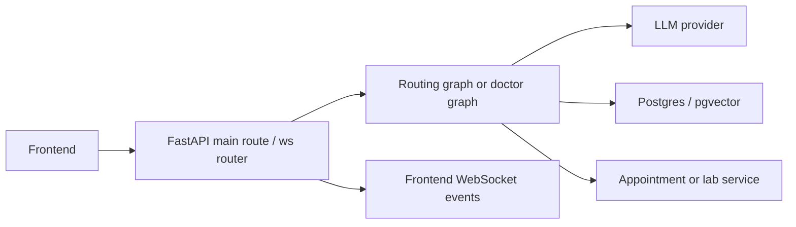
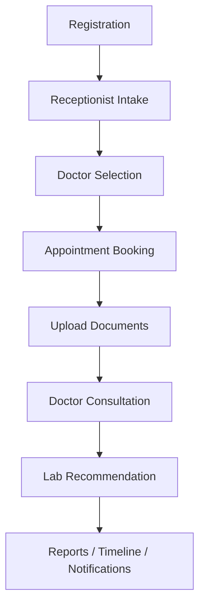

# PROJECT_HANDOVER

## 1. Project Overview

### Purpose
Ally AI is a prototype clinical triage and consultation platform that combines a receptionist-style intake flow, doctor consultation, document upload, retrieval-augmented grounding, and stubbed lab/report workflows. The repository is structured as a research/demo application rather than a production clinical system.

### Problem it solves
The repository demonstrates how a patient-facing conversational flow can:
- collect a symptom intake,
- route the user to a department or doctor,
- support a doctor-style consultation,
- optionally ingest prior documents,
- recommend lab tests,
- persist a consultation summary and timeline,
- and surface notifications through a web UI.

### Current development status
The codebase is in a prototype / Phase 0 to Phase 3 style state with several pieces implemented and several intentionally stubbed:
- working receptionist booking flow,
- working doctor consultation flow through WebSocket,
- document upload and embedding pipeline,
- Postgres + pgvector persistence for messages, knowledge chunks, uploaded files, notifications, consultation contexts, and timelines,
- shared specialty abstraction and registry,
- stubbed appointment and lab service integration,
- no real authentication or production-grade security.

### Overall architecture
The system is split into:
- a Next.js frontend for the conversational UI,
- a FastAPI backend for orchestration, AI agent execution, persistence, and WebSocket handling,
- a PostgreSQL + pgvector store for messages and RAG data,
- reference Go services for appointments and lab workflows,
- a knowledge ingest pipeline for embedding source documents.

### Technologies used
- Backend: Python, FastAPI, LangGraph, Pydantic
- Frontend: Next.js, React, TypeScript
- Database: PostgreSQL with pgvector
- AI: OpenAI-compatible model calls via NVIDIA NIM / OpenRouter / Ollama
- Embeddings: NVIDIA embedding model via OpenAI client
- Containerization: Docker Compose
- Reference services: Go, net/http, chi-style routing in the service layer

### Major dependencies
- [backend/general_physician/requirements.txt](backend/general_physician/requirements.txt)
- [frontend/package.json](frontend/package.json)
- [docker-compose.yml](docker-compose.yml)
- [services/appointment/README.md](services/appointment/README.md)

### How services communicate
- Frontend to backend: WebSocket for conversational events and HTTP for upload/register/report endpoints.
- Backend to Postgres: direct psycopg2 connections.
- Backend to appointment service: HTTP client in [backend/shared/appointment_client.py](backend/shared/appointment_client.py).
- Backend to lab service: HTTP client in [backend/shared/lab_client.py](backend/shared/lab_client.py).
- Backend to LLM providers: OpenAI-compatible client in [backend/general_physician/llm/nvidia_client.py](backend/general_physician/llm/nvidia_client.py) and [backend/general_physician/llm/embeddings.py](backend/general_physician/llm/embeddings.py).

---

## 2. Repository Structure

### [backend/](backend/)
Purpose: application backend, models, AI graphs, persistence, and service helpers.

Important files:
- [backend/general_physician/main.py](backend/general_physician/main.py) — FastAPI entrypoint and REST routes.
- [backend/general_physician/ws/router.py](backend/general_physician/ws/router.py) — WebSocket router and event dispatch.
- [backend/general_physician/agent.py](backend/general_physician/agent.py) — doctor consultation orchestration.
- [backend/general_physician/graphs/routing_graph.py](backend/general_physician/graphs/routing_graph.py) — receptionist booking flow.
- [backend/general_physician/db/pgvector_tracker.py](backend/general_physician/db/pgvector_tracker.py) — persistence helpers over Postgres.
- [backend/specialties/dispatcher.py](backend/specialties/dispatcher.py) and [backend/specialties/registry.py](backend/specialties/registry.py) — specialty resolution.

Responsibilities:
- API handling,
- WebSocket state machine,
- RAG retrieval,
- LLM orchestration,
- DB persistence.

Dependencies:
- Postgres/pgvector,
- LLM provider,
- frontend WS protocol,
- Go services.

### [frontend/](frontend/)
Purpose: Next.js interface for signup, chat, appointments, inbox, reports, and profile.

Important files:
- [frontend/app/signup/page.tsx](frontend/app/signup/page.tsx)
- [frontend/app/chat/page.tsx](frontend/app/chat/page.tsx)
- [frontend/hooks/useChatSocket.ts](frontend/hooks/useChatSocket.ts)
- [frontend/lib/patient.ts](frontend/lib/patient.ts)
- [frontend/components/sidebar/AppointmentsPanel.tsx](frontend/components/sidebar/AppointmentsPanel.tsx)

Responsibilities:
- registration UI,
- conversation UI,
- appointment handoff UI,
- upload UI,
- report display.

Dependencies:
- backend WebSocket endpoint,
- backend registration/upload/report endpoints.

### [services/](services/)
Purpose: reference microservices for appointments and lab workflows.

Important files:
- [services/appointment/README.md](services/appointment/README.md)
- [services/lab/main.go](services/lab/main.go)

Responsibilities:
- appointment data and booking,
- lab request and report persistence.

Dependencies:
- Postgres,
- backend service clients.

### [knowledge/](knowledge/)
Purpose: source knowledge assets used by the ingest pipeline and RAG workflow.

Responsibilities:
- storing knowledge documents and text assets,
- feeding embeddings into pgvector.

### [migrations/](migrations/)
Purpose: database migration scaffolding and Alembic layout.

Responsibilities:
- schema evolution support,
- future DB changes.

### [scripts/](scripts/)
Purpose: seeding and utility scripts.

Important files:
- [scripts/seed.py](scripts/seed.py)

### [docs/](docs/)
Purpose: architecture and progress notes.

Important files:
- [ARCHITECTURE.md](ARCHITECTURE.md)
- [TASK_HISTORY.md](TASK_HISTORY.md)

---

## 3. Runtime Architecture

### Startup flow
1. Docker Compose starts Postgres, then backend, then appointment and lab services (if used).
2. Backend initializes the database schema via [backend/general_physician/db/pgvector_tracker.py](backend/general_physician/db/pgvector_tracker.py).
3. The FastAPI app in [backend/general_physician/main.py](backend/general_physician/main.py) starts and includes the WebSocket router.
4. The frontend connects to the backend WebSocket on startup with the current user id.

### Request flow

### WebSocket flow
- The frontend opens [frontend/hooks/useChatSocket.ts](frontend/hooks/useChatSocket.ts) to connect to the backend WebSocket endpoint.
- The backend accepts connections at [backend/general_physician/ws/router.py](backend/general_physician/ws/router.py).
- Incoming events are parsed into a client event envelope and dispatched to either the routing graph or the doctor graph.
- Outgoing events are emitted as typed WebSocket events such as text, text_delta, doctor_select, slot_select, doctor_ready, lab_notification, report_ready, and consultation_chart.

### Authentication
There is no real authentication implementation. The current flow uses a client-side user id derived from the profile or a session id. Registration is effectively a patient identity creation step, not a login flow.

### Persistence
- Postgres stores users, sessions, messages, knowledge_chunks, uploaded_files, notifications, consultation_contexts, and patient_timelines.
- In-memory demo data is used for appointment/doctor/slot state through [backend/general_physician/services/local_store.py](backend/general_physician/services/local_store.py).

### Routing
- Receptionist routing is handled by [backend/general_physician/graphs/routing_graph.py](backend/general_physician/graphs/routing_graph.py).
- Doctor routing is resolved through [backend/specialties/dispatcher.py](backend/specialties/dispatcher.py) and [backend/specialties/registry.py](backend/specialties/registry.py).

### Service communication
- Appointment service: HTTP calls to the Go service for user/slot/appointment operations.
- Lab service: HTTP calls for booking and retrieving lab-related work.
- LLM service: OpenAI-compatible model calls over HTTP.

---

## 4. Docker Architecture

### Containers
- postgres: Postgres with pgvector.
- backend: FastAPI application using the general physician container image.
- appointment: reference Go appointment service.
- lab: reference Go lab service.
- frontend: Next.js dev server.

### docker-compose layout
Defined in [docker-compose.yml](docker-compose.yml).

### Exposed ports
- Postgres: 5432
- Backend: 8000
- Appointment service: 8081
- Lab service: 8082
- Frontend: 3000

### Networks
The compose file uses the default Docker bridge network. No custom network is defined.

### Environment variables
The backend container receives Postgres connection values and service URLs from the environment and from the repository .env file.

### Startup order
- Postgres starts first and healthchecks before other services proceed.
- Backend waits for Postgres and the appointment/lab services to start.
- Frontend starts after Postgres and does not wait on backend.

### Inter-service communication
- Backend reaches appointment and lab via service names: http://appointment:8081 and http://lab:8082.
- Frontend is primarily a client of the backend service.

---

## 5. Backend Flow

### Request lifecycle from API entry to response
1. The FastAPI app in [backend/general_physician/main.py](backend/general_physician/main.py) starts.
2. The WebSocket router in [backend/general_physician/ws/router.py](backend/general_physician/ws/router.py) accepts events.
3. For receptionist events, the router invokes [backend/general_physician/graphs/routing_graph.py](backend/general_physician/graphs/routing_graph.py).
4. When the booking flow reaches completion, the router emits a doctor-ready event and returns the appointment id.
5. When the patient starts the consultation, the router resolves the specialty implementation and invokes the doctor graph.
6. The doctor graph uses:
   - retrieval context from [backend/general_physician/rag/retriever.py](backend/general_physician/rag/retriever.py),
   - patient context from [backend/general_physician/agent.py](backend/general_physician/agent.py),
   - persistence helpers from [backend/general_physician/db/pgvector_tracker.py](backend/general_physician/db/pgvector_tracker.py).
7. The flow can emit lab notifications and create persisted lab work items and notifications.
8. The frontend consumes these events and updates chat, inbox, reports, and appointment panels.

### Router / controller / service / model / repository split
- Router: [backend/general_physician/ws/router.py](backend/general_physician/ws/router.py), [backend/general_physician/main.py](backend/general_physician/main.py)
- Controller-style handlers: REST route handlers in [backend/general_physician/main.py](backend/general_physician/main.py)
- Service layer: [backend/general_physician/services/local_store.py](backend/general_physician/services/local_store.py), [backend/shared/appointment_client.py](backend/shared/appointment_client.py), [backend/shared/lab_client.py](backend/shared/lab_client.py)
- Models: [backend/general_physician/models/session_state.py](backend/general_physician/models/session_state.py), [backend/models/intake.py](backend/models/intake.py), [backend/models/notification.py](backend/models/notification.py), [backend/models/timeline.py](backend/models/timeline.py)
- Persistence layer: [backend/general_physician/db/pgvector_tracker.py](backend/general_physician/db/pgvector_tracker.py)
- Middleware: CORS middleware in [backend/general_physician/main.py](backend/general_physician/main.py)

---

## 6. AI Architecture

### Agent framework
The core runtime uses LangGraph state graphs with a MemorySaver checkpointer. The main graphs are:
- [backend/general_physician/graphs/routing_graph.py](backend/general_physician/graphs/routing_graph.py)
- [backend/general_physician/agent.py](backend/general_physician/agent.py)

### Orchestration
The routing graph collects intake details and selects a doctor or department. The doctor graph then drives the consultation loop, questions the patient, decides whether to recommend labs, and persists the consultation state.

### Prompts
Prompt templates are centralized in [backend/general_physician/prompts.py](backend/general_physician/prompts.py) and department-specific prompts are loaded via [backend/general_physician/department_config.py](backend/general_physician/department_config.py).

### Memory
Conversation memory is stored in the messages table and reused by the doctor agent for context. The agent also builds a compact patient context block before prompting the LLM.

### Context building
The doctor context is assembled from:
- age / medical details,
- prior visits,
- uploaded documents,
- the conversation history,
- retrieved RAG passages.

### Retrieval
The retriever in [backend/general_physician/rag/retriever.py](backend/general_physician/rag/retriever.py) builds a query from recent user turns and the chief complaint, embeds it, then searches pgvector for similar passages.

### Embeddings
Embedding calls are made by [backend/general_physician/llm/embeddings.py](backend/general_physician/llm/embeddings.py). The default embedding model is NVIDIA's embed model with 1024-dim vectors.

### RAG
The repository implements a document upload -> chunk -> embed -> store -> retrieve pipeline. Uploaded documents are chunked and inserted into the knowledge_chunks table for similarity search.

### Model providers
Model calls are routed through [backend/general_physician/llm/nvidia_client.py](backend/general_physician/llm/nvidia_client.py). The client supports:
- NVIDIA NIM,
- OpenRouter,
- Ollama.

### Routing graph
The receptionist graph collects intent, recommends a department, creates a canonical intake contract, and emits doctor-select and slot-select events.

### Specialty handling
Specialties are resolved through a shared dispatcher and registry. The current implementations are:
- General Physician: [backend/general_physician/agent.py](backend/general_physician/agent.py)
- Cardiology: [backend/specialties/cardiology/consultation_controller.py](backend/specialties/cardiology/consultation_controller.py)

### Tool calling
There is no structured tool-calling layer in the current implementation. The backend uses HTTP service clients as side-effecting integrations rather than a formal tool interface.

### State management
State is managed through LangGraph state objects and the WebSocket router's in-memory user state. The doctor graph also uses a MemorySaver checkpointer for resumable execution.

---

## 7. Current Features

| Feature | Location | Status | Dependencies |
|---|---|---|---|
| Registration | [backend/general_physician/main.py](backend/general_physician/main.py), [frontend/app/signup/page.tsx](frontend/app/signup/page.tsx) | Implemented | Postgres persistence, frontend fetch call |
| Receptionist intake | [backend/general_physician/graphs/routing_graph.py](backend/general_physician/graphs/routing_graph.py) | Implemented | LLM provider, local store |
| Doctor selection | [backend/general_physician/graphs/routing_graph.py](backend/general_physician/graphs/routing_graph.py) | Implemented | local store |
| Appointment booking | [backend/general_physician/services/local_store.py](backend/general_physician/services/local_store.py) | Implemented in demo/local mode | local store or appointment service |
| Consultation handoff | [backend/general_physician/ws/router.py](backend/general_physician/ws/router.py) | Implemented | WebSocket + routing graph |
| Doctor consultation | [backend/general_physician/agent.py](backend/general_physician/agent.py) | Implemented | LLM provider, RAG, Postgres |
| Document upload | [backend/general_physician/main.py](backend/general_physician/main.py) | Implemented | pymupdf, embeddings, Postgres |
| RAG / knowledge retrieval | [backend/general_physician/rag/retriever.py](backend/general_physician/rag/retriever.py) | Implemented | pgvector, embeddings |
| Conversation memory | [backend/general_physician/db/pgvector_tracker.py](backend/general_physician/db/pgvector_tracker.py) | Implemented | messages table |
| Timeline / longitudinal history | [backend/models/timeline.py](backend/models/timeline.py) | Implemented as model + persistence helper | Postgres |
| Notifications model + persistence | [backend/models/notification.py](backend/models/notification.py) | Implemented | notifications table |
| Consultation context persistence | [backend/models/intake.py](backend/models/intake.py) | Implemented | consultation_contexts table |
| Lab recommendation flow | [backend/general_physician/agent.py](backend/general_physician/agent.py) | Implemented | lab service client |
| Report route | [backend/general_physician/main.py](backend/general_physician/main.py) | Implemented | PDF files under reports |
| Specialty abstraction | [backend/specialties/base.py](backend/specialties/base.py) | Implemented | registry/dispatcher |
| Cardiology specialty scaffold | [backend/specialties/cardiology/consultation_controller.py](backend/specialties/cardiology/consultation_controller.py) | Partial | specialty registry |
| WebSocket-based UI conversation | [frontend/hooks/useChatSocket.ts](frontend/hooks/useChatSocket.ts) | Implemented | backend WS |

---

## 8. End-to-End Workflow

1. Registration
   - The patient submits the signup form in [frontend/app/signup/page.tsx](frontend/app/signup/page.tsx).
   - The frontend calls the backend registration endpoint.
   - The backend creates a patient and a session and returns ids.

2. Receptionist intake
   - The frontend opens the WebSocket and the backend starts the routing graph.
   - The receptionist asks questions and proposes doctors and slots.

3. Doctor selection
   - The user selects a doctor.
   - The routing graph emits a slot_select event.

4. Appointment booking
   - The user selects a slot.
   - The routing graph books the appointment and emits doctor_ready.

5. Upload
   - The patient can upload documents before the doctor consultation.
   - The backend chunks and embeds them and stores them for RAG.

6. Consultation
   - The frontend starts the consultation and the backend doctor graph begins.
   - The doctor asks focused questions and may recommend labs.

7. Lab
   - If accepted, the backend creates a lab work item and a notification and calls the lab service client.

8. Reports
   - The backend can serve generated PDF reports from the reports directory.

9. Timeline and notifications
   - Consultation outcomes are persisted into the timeline and notifications tables.

---

## 9. Specialty System

### How specialties are added
To add a new specialty:
1. Create a module under [backend/specialties/](backend/specialties/).
2. Implement a class that inherits from [backend/specialties/base.py](backend/specialties/base.py).
3. Implement the required methods: initialize_consultation, load_consultation_context, load_patient_history, load_patient_documents, run_consultation, generate_summary, recommend_labs, complete_consultation.
4. Register the class in [backend/specialties/registry.py](backend/specialties/registry.py).
5. Optionally add department-specific prompts and config.

### Existing specialties
- General Physician: implemented by [backend/general_physician/agent.py](backend/general_physician/agent.py)
- Cardiology: scaffolded in [backend/specialties/cardiology/consultation_controller.py](backend/specialties/cardiology/consultation_controller.py)

### Shared interfaces
- [backend/specialties/base.py](backend/specialties/base.py) defines the common contract.
- [backend/specialties/dispatcher.py](backend/specialties/dispatcher.py) resolves a consultation context to a specialty.
- [backend/specialties/registry.py](backend/specialties/registry.py) owns the department-to-specialty mapping.

### Inheritance
The specialty system is intentionally lightweight and uses inheritance rather than a plugin framework.

### Registration
The registry currently registers:
- general / general physician -> GeneralPhysicianSpecialty
- cardiology -> CardiologySpecialty

### Common abstractions
- consultation context,
- patient history loading,
- patient document loading,
- consultation execution,
- summary generation,
- lab recommendation.

### Required files
A typical specialty implementation needs at minimum:
- a specialty adapter class,
- a state object if the workflow is complex,
- a prompt or reasoning module if the specialty uses distinct AI behavior,
- a registration entry.

---

## 10. Data Models

### Patient
Represented by the users table and the patient registration flow.

Important fields:
- id: logical patient / user id in Postgres
- name
- age
- health_data (JSONB)
- created_at

Source:
- [backend/general_physician/db/pgvector_tracker.py](backend/general_physician/db/pgvector_tracker.py)

### Appointment
The in-process appointment model is defined in [backend/general_physician/services/local_store.py](backend/general_physician/services/local_store.py). The Go service has its own schematized appointment model.

Important fields:
- id
- doctor_id
- slot_id
- patient
- reason
- department
- patient_id
- session_id
- consultation_context_id
- status

### Consultation
Canonical handoff object in [backend/models/intake.py](backend/models/intake.py).

Important fields:
- patient_reference
- patient_id
- internal_uuid
- session_id
- clinical_intake_record
- selected_department
- selected_doctor
- appointment_id
- consultation_status
- metadata

### Lab
Lab requests are represented by lab work items in the Postgres DB and a service payload in the lab client.

Important fields:
- lab_request_id
- patient_id
- appointment_id
- consultation_context_id
- doctor_name
- department
- requested_tests
- status

### Doctor
Defined in the local demo store and surfaced through the appointment service.

Important fields:
- id
- name
- department_id

### Session
Stored in the sessions table.

Important fields:
- id
- user_id
- current_state
- appointment_id
- metadata

### Memory
Conversation memory is stored in the messages table.

Important fields:
- role
- content
- session_id
- user_id

### Timeline
Canonical longitudinal history in [backend/models/timeline.py](backend/models/timeline.py).

Important fields:
- timeline_id
- patient_id
- history entries with appointment_id, consultation_context_id, department, doctor, chief_complaint, clinical_summary, assessment, recommended_tests, status

### Report
Generated as PDF files under the reports directory and served by the report endpoint.

### Notification
Canonical notification model in [backend/models/notification.py](backend/models/notification.py).

Important fields:
- notification_id
- patient_id
- appointment_id
- consultation_context_id
- department
- doctor
- notification_type
- title
- message
- metadata
- status

---

## 11. APIs

| Method | Endpoint | Purpose | Input | Output | Called by | Used in |
|---|---|---|---|---|---|---|
| GET | / | Health / root | none | status payload | browser / health checks | startup sanity |
| GET | /health | Health check | none | status payload | deployment / tests | monitoring |
| POST | /register | Create patient and session | registration payload | patient_id, session_id | frontend signup | registration workflow |
| POST | /upload-document/{user_id}/{appointment_id} | Upload and index a document | multipart file | ok + filename | frontend appointments panel | upload workflow |
| GET | /reports/{report_id} | Download report PDF | report id | PDF file | frontend report links | report workflow |
| GET | /uploaded-files/{user_id}/{appointment_id} | List uploaded files | user id, appointment id | files list | frontend pre-consultation UI | upload workflow |
| GET | /nv-test | Probe model connectivity | none | model response | manual testing | diagnostics |
| POST | /chat | REST shortcut for receptionist flow | chat request | reply + doctors + slots | external callers / tests | quick testing |
| WS | /ws/{user_id} | Main conversational interface | JSON client events | JSON server events | frontend chat hook | main app flow |
| POST | /lab-tests | Lab service creation | lab payload | lab result | backend lab client | lab workflow |
| GET | /health | Lab service health | none | health payload | health checks | lab service |

---

## 12. Database / Persistence

### Where data is stored
- Postgres: primary durable store for users, sessions, messages, knowledge chunks, uploaded files, notifications, consultation contexts, timelines, and lab work items.
- In-memory local store: appointment, doctor, and slot data used by the receptionist flow.
- File system: generated report PDFs under the reports directory.
- Browser storage: profile/session state in localStorage and sessionStorage in the frontend.

### Data classes
- JSONB fields are used for patient health_data, metadata, and consultation payloads.
- Vector search is implemented via pgvector on the knowledge_chunks table.
- The repository does not present a fully normalized domain model; a number of workflow concepts are still serialized into JSONB.

### Missing persistence
- The current appointment flow is not fully persisted to the same durable store as the rest of the backend; the demo path uses the in-memory local store.
- There is no persistent authentication or user account model beyond the rudimentary patient record.
- Notification delivery is persisted but not pushed to an external channel.

---

## 13. External Services

### LLMs
Default LLM provider is configurable through the environment. The code supports:
- NVIDIA NIM via [backend/general_physician/llm/nvidia_client.py](backend/general_physician/llm/nvidia_client.py)
- OpenRouter
- Ollama

### Embedding models
Default embedding model: nvidia/nv-embedqa-e5-v5 with 1024-dim vectors.

### Appointment service
Reference Go service on port 8081. Used by the shared appointment client.

### Lab service
Reference Go service on port 8082. Used by the shared lab client for lab request submission.

### Notification service
No dedicated external notification service. Notifications are persisted and emitted as WebSocket domain events.

### Vector DB
Postgres with pgvector.

### MCP servers
None detected in the repository.

### External APIs
The repository relies on the LLM provider API and the appointment/lab service HTTP APIs.

---

## 14. Configuration

| Variable | Purpose | Used in | Default |
|---|---|---|---|
| POSTGRES_DB | Postgres DB name | backend DB helper and compose | allyai |
| POSTGRES_USER | Postgres username | backend DB helper and compose | allyai |
| POSTGRES_PASSWORD | Postgres password | backend DB helper and compose | allyai |
| POSTGRES_HOST | Postgres host | backend DB helper | localhost |
| POSTGRES_PORT | Postgres port | backend DB helper | 5432 |
| NVIDIA_API_KEY | LLM access key | LLM client | none |
| NVIDIA_MODEL | chat model | LLM client | meta/llama-3.1-8b-instruct |
| NVIDIA_BASE_URL | model endpoint base URL | LLM client and embeddings | https://integrate.api.nvidia.com/v1 |
| NVIDIA_EMBED_MODEL | embedding model | embeddings client | nvidia/nv-embedqa-e5-v5 |
| OPENROUTER_API_KEY | OpenRouter auth | LLM client | none |
| OPENROUTER_BASE_URL | OpenRouter API base | LLM client | https://openrouter.ai/api/v1 |
| OPENROUTER_MODEL | fallback chat model | LLM client | same as NVIDIA_MODEL |
| OPENROUTER_HTTP_REFERER | OpenRouter header | LLM client | https://localhost |
| OPENROUTER_TITLE | OpenRouter header | LLM client | AllyAI |
| OLLAMA_BASE_URL | Ollama API base | LLM client | http://localhost:11434 |
| LLM_PROVIDER | provider selection | LLM client | auto-detected |
| APPOINTMENT_SERVICE_URL | appointment service base URL | appointment client | http://appointment:8081 |
| LAB_SERVICE_URL | lab service base URL | lab client | http://lab:8082 |

Source: [.env.example](.env.example)

---

## 15. Current Technical Debt

- The backend startup path catches database initialization failures and continues in a degraded mode. This creates inconsistent persistence behavior across environments.
- The appointment flow uses an in-memory store for doctors, slots, and appointments rather than a durable service-backed model.
- The frontend uses hard-coded localhost URLs for document uploads and report access. This is a portability issue for Docker or remote hosts.
- The shared appointment and lab clients are thin wrappers with minimal error handling and no retry strategy.
- The project mixes direct DB logic, agent logic, and service logic in the same modules rather than strictly separating concerns.
- There are placeholder-style pass statements and stubbed implementations in the shared service layer.
- The specialty system is extensible in principle but currently only partially wired into the runtime path.

---

## 16. Current Bugs

- The repository assumes Postgres is available; if the DB is unavailable, the app may continue but persistence features silently degrade.
- The frontend document upload path uses hard-coded localhost addresses, which will break when the backend is not served from the same host.
- The specialist routing path is partially implemented; unknown or unsupported departments currently fail with a registry error.
- The lab integration is not a full production workflow; the backend can create a request but the downstream process remains minimal and error-prone.
- The current implementation is not suitable for production security because there is no authentication, authorization, or secure session model.
- The current UI and backend use transient session identifiers rather than a robust patient identity and access model.

---

## 17. Missing Features

| Feature | What exists | What is missing | Estimated effort | Blocking dependencies |
|---|---|---|---|---|
| Authentication | none | real login / auth / role model | Large | user model and session security |
| Real appointment integration | local demo store and Go service client | durable appointment service fusion | Medium | appointment service schema alignment |
| Real lab integration | lab client + stubbed request path | end-to-end lab processing and reports | Large | lab service schema and workflow |
| Neurology specialty | department exists in local store | no active runtime wiring | Medium | registry + prompts + agent |
| Notification delivery | model + persistence | push / email / SMS / UI delivery | Medium | notification channel design |
| Production persistence | Postgres tables | backup, migrations, operational durability | Medium | migration strategy |
| Clinical safeguards | prompts and heuristics | policy layer, validation, audit | Large | product / clinical review |

---

## 18. Code Quality Assessment

### Architecture
The repository has a clear high-level split between frontend, FastAPI backend, AI graphs, persistence, and service clients. The specialty dispatcher and registry provide a reusable abstraction for adding new departments.

### Modularity
The backend is reasonably modular, but there are still high-impact modules that mix orchestration, persistence, and prompt formatting. The doctor agent, for example, contains both graph logic and persistence concerns.

### Maintainability
The project is maintainable for a prototype because the core flow is centralized and the main state machine is explicit. However, broad exception handling and fallback logic reduce clarity.

### Coupling
There is moderate coupling between the frontend and the backend event model. The frontend is aware of specific WebSocket event names and payload shapes, and the backend uses in-memory router state to track context.

### Technical debt
The biggest sources of debt are the in-memory appointment store, the lack of auth, the hard-coded localhost assumptions, and the partial specialty and lab integration.

### Reusability
The specialty abstraction is reusable. The shared client layer is also reusable, but the current implementations are thin and not production-hardened.

### Extensibility
The architecture is extensible for new specialties and new backend services, but the runtime path still requires manual wiring in the registry and the frontend event handling.

---

## 19. Priority Roadmap

### Immediate tasks
1. Replace hard-coded localhost URLs with configurable base URLs.
2. Make persistence failures observable and avoid silent degraded mode.
3. Align the frontend with the backend registration and session model.

### Next tasks
4. Complete appointment persistence by moving beyond the local demo store.
5. Finish the cardiology specialty runtime path and add a second active specialty.
6. Add a durable notification delivery path beyond WebSocket events.

### Future improvements
7. Add authentication and secure patient/session handling.
8. Implement real lab workflow and report generation.
9. Add end-to-end integration tests and deployment hardening.

---

## 20. Files Worth Reading First

1. [backend/general_physician/main.py](backend/general_physician/main.py) — backend entrypoint, REST routes, registration, upload, report endpoints.
2. [backend/general_physician/ws/router.py](backend/general_physician/ws/router.py) — WebSocket lifecycle, routing vs doctor handoff.
3. [backend/general_physician/graphs/routing_graph.py](backend/general_physician/graphs/routing_graph.py) — receptionist flow and booking state machine.
4. [backend/general_physician/agent.py](backend/general_physician/agent.py) — doctor agent orchestration and consultation persistence.
5. [backend/general_physician/db/pgvector_tracker.py](backend/general_physician/db/pgvector_tracker.py) — persistence model over Postgres.
6. [backend/general_physician/rag/retriever.py](backend/general_physician/rag/retriever.py) — retrieval and RAG context assembly.
7. [backend/general_physician/llm/nvidia_client.py](backend/general_physician/llm/nvidia_client.py) — LLM provider abstraction.
8. [backend/general_physician/llm/embeddings.py](backend/general_physician/llm/embeddings.py) — embedding client.
9. [backend/general_physician/services/local_store.py](backend/general_physician/services/local_store.py) — in-memory booking/demo data.
10. [backend/specialties/dispatcher.py](backend/specialties/dispatcher.py) — specialty resolution.
11. [backend/specialties/registry.py](backend/specialties/registry.py) — specialty registration.
12. [backend/specialties/base.py](backend/specialties/base.py) — specialty contract.
13. [backend/specialties/cardiology/consultation_controller.py](backend/specialties/cardiology/consultation_controller.py) — cardiology specialty scaffold.
14. [backend/models/intake.py](backend/models/intake.py) — consultation context model.
15. [backend/models/notification.py](backend/models/notification.py) — notification model.
16. [backend/models/timeline.py](backend/models/timeline.py) — longitudinal history model.
17. [backend/general_physician/models/session_state.py](backend/general_physician/models/session_state.py) — typed WS event and graph state models.
18. [frontend/hooks/useChatSocket.ts](frontend/hooks/useChatSocket.ts) — client WebSocket runtime.
19. [frontend/app/chat/page.tsx](frontend/app/chat/page.tsx) — chat shell and tab orchestration.
20. [frontend/app/signup/page.tsx](frontend/app/signup/page.tsx) — registration UI.
21. [frontend/lib/patient.ts](frontend/lib/patient.ts) — client-side patient/session helpers.
22. [frontend/components/sidebar/AppointmentsPanel.tsx](frontend/components/sidebar/AppointmentsPanel.tsx) — appointment and consultation UI.
23. [docker-compose.yml](docker-compose.yml) — service composition.
24. [.env.example](.env.example) — environment configuration.
25. [Makefile](Makefile) — test and compose helpers.
26. [services/lab/main.go](services/lab/main.go) — lab service entrypoint.
27. [backend/shared/appointment_client.py](backend/shared/appointment_client.py) — appointment service HTTP client.
28. [backend/shared/lab_client.py](backend/shared/lab_client.py) — lab service HTTP client.
29. [ARCHITECTURE.md](ARCHITECTURE.md) — higher-level architecture notes.
30. [TASK_HISTORY.md](TASK_HISTORY.md) — repository history and progress notes.

---

## 21. Build and Run

### Install
Python backend:
- create and activate a virtual environment
- install dependencies: pip install -r backend/general_physician/requirements.txt

Frontend:
- cd frontend
- npm install

### Configure
- copy [.env.example](.env.example) to .env
- set a valid NVIDIA API key or another provider key
- ensure Postgres and the service URLs are reachable

### Run locally
Postgres:
- docker compose up -d postgres

Backend:
- uvicorn backend.general_physician.main:app --reload --host 0.0.0.0 --port 8000

Frontend:
- cd frontend
- npm run dev

### Debug
- use the browser UI at http://localhost:3000
- use the WebSocket route at ws://localhost:8000/ws/{user_id}
- inspect logs from the backend process and the browser developer console
- test the registration and upload routes directly with curl or Postman

### Test
- pytest -q backend/general_physician/tests
- optionally run the Docker-based checks: make docker-checks

### Rebuild Docker
- docker compose up --build
- or use the checks compose file for reproducible test runs

---

## 22. Testing Checklist

### Registration
- Open the signup page.
- Submit a valid patient form with consent.
- Expected: backend returns patient_id and session_id; frontend navigates to the chat UI.

### Receptionist booking
- Send a symptom message in chat.
- Expected: the receptionist asks follow-up questions and emits doctor selection and slot selection events.

### Appointment confirmation
- Select a doctor and a slot.
- Expected: the flow reaches a booking confirmation and the UI shows an appointment-ready state.

### Document upload
- Upload a PDF or text file before the consultation.
- Expected: the backend acknowledges the upload and eventually marks it indexed.

### Consultation
- Start consultation from the appointments panel.
- Expected: the doctor asks focused questions and may recommend labs.

### Lab decision
- Accept or reject the lab recommendation.
- Expected: the backend records the decision and persists a notification / lab work item.

### Reports
- Open a report endpoint.
- Expected: the PDF is served successfully.

### Persistence
- Restart the backend and re-open the session.
- Expected: messages and some persisted context should be recoverable if Postgres is healthy.

---

## 23. Final Project Status

### Estimated completion
- Architecture: 75%
- Backend: 70%
- Frontend: 80%
- AI: 65%
- Integration: 40%
- Testing: 35%
- Production readiness: 10%

### Most important remaining work
1. Replace hard-coded local endpoints with configurable deployment-safe URLs.
2. Add real authentication and robust patient identity handling.
3. Replace the in-memory appointment model with a durable service-backed flow.
4. Complete the specialty runtime path and add a second active specialty beyond general physician.
5. Implement a real notification delivery mechanism and strengthen end-to-end testing.
